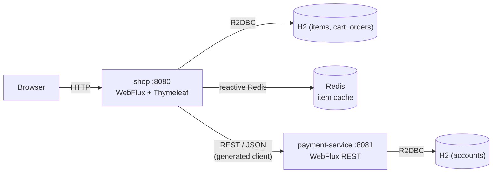
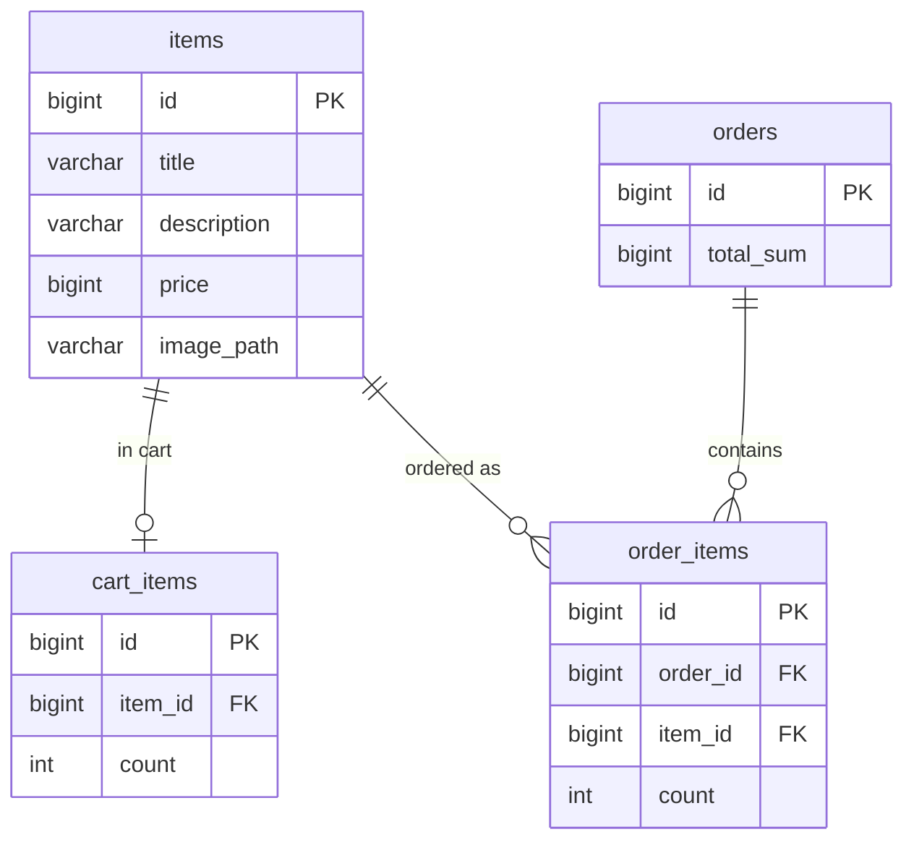
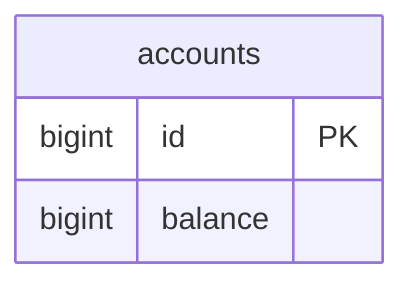

# my-market-app

Reactive online store split into two modules:

- **`shop`**: the main app for browsing items, managing a cart, and placing orders.
- **`payment-service`**: a RESTful service that checks the balance and withdraws funds.

The main app talks to the payment service over an REST api, caches the item catalog in Redis and uses H2 as datasource for item/orders/cart data.

## Contents

- [Stack](#stack)
- [Architecture](#architecture)
- [Build](#build)
- [Run](#run)
- [Test](#test)
- [API](#api)
- [Storage](#storage)

## Stack

- Java 21, Spring Boot 4
- Spring WebFlux (reactive), embedded Netty, Project Reactor (`Mono`/`Flux`)
- Spring Data R2DBC + H2 (in-memory) for both services
- Spring Data Redis (reactive) for the item cache
- OpenAPI Generator 7.23 (contract-first, reactive client + server)
- Thymeleaf (main app views)
- Gradle
- JUnit 5, Mockito, Testcontainers

## Architecture



| Module | Port | Responsibility                                      |
|--------|------|-----------------------------------------------------|
| `shop` | 8080 | UI + purchase flow; Redis cache; main functionality |
| `payment-service` | 8081 | Balance / payment REST API                          |
| `openapi/payment-api.yaml` |  | Contract shared by both modules                     |

## Build

Build everything:

```bash
./gradlew build
```

A single module:

```bash
./gradlew :shop:build
./gradlew :payment-service:build
```

The build generates reactive code (contract-first) from `openapi/payment-api.yaml`: HTTP client (`DefaultApi`) for `shop` and server interface (`AccountsApi`) for `payment-service`.

## Run

### Docker Compose (recommended)

Builds images and starts `shop`, `payment-service` and `redis` together:

```bash
docker-compose up --build
```

- Main app: http://localhost:8080
- Payment service: http://localhost:8081
- Redis: `localhost:6379`

Inside the compose network main app reaches payment service at
`http://payment-service:8081` and Redis at `redis:6379`.

Stop and remove:

```bash
docker-compose down
```

View logs (follow, `Ctrl+C` to stop):

```bash
docker-compose logs -f shop              
docker-compose logs -f payment-service   
docker-compose logs -f                   #both apps
```

### Locally, service by service

Defaults already point at `localhost`, so only start the pieces:

```bash
docker run --rm -p 6379:6379 redis:7-alpine   # Redis :6379
./gradlew :payment-service:bootRun             # payment :8081
./gradlew :shop:bootRun                         # main app :8080
```

Redis is optional for local runs. Without it the main app falls back to the DB.

## Test

```bash
./gradlew test
```

Integration tests use Testcontainers, so Docker must be running.

### `shop`

- **Unit**: `RedisItemProviderUnitTest`, `ItemServiceUnitTest`,
  `CartServiceUnitTest`, `OrderServiceUnitTest`, `PaymentServiceClientUnitTest`,
  `ItemMapperTest`, `OrderMapperTest`.
- **Repositories**: `ItemRepositoryTest`, `CartItemRepositoryTest`,
  `OrderRepositoryTest`, `OrderItemRepositoryTest`.
- **Controllers**: `ItemControllerTest`,
  `CartControllerTest`, `OrderControllerTest`, `ImageControllerTest`.
- **Integration**:
  - `RedisItemProviderIntegrationTest`: item details come from Redis, missing ones from the
    DB, id order kept.
  - `ItemServiceIntegrationTest`: catalog and item page read through the cache.
  - `CartServiceIntegrationTest`: cart changes and total against the real DB.
  - `OrderServiceIntegrationTest`: buy saves the order and clears the cart (payment mocked).
  - `ShopFlowIntegrationTest`: full flow, add to cart, buy, order appears, cart cleared (payment mocked).
  - `PaymentServiceClientIntegrationTest`: client calls a Testcontainers Microcks mock over
    HTTP and maps `200`/`404`/`422` to results (plain JUnit, not `@SpringBootTest`).

### `payment-service`

- **Unit**: `PaymentServiceUnitTest`.
- **Repositories**: `AccountRepositoryTest`.
- **Integration**:
  - `AccountsControllerIntegrationTest`: endpoints return `200`, `404` (unknown account),
    `422` (insufficient funds), `400` (invalid amount).

## API

### `shop` web endpoints

| Method | URL | Description |
|--------|-----|-------------|
| GET | `/`, `/items?search=&sort=NO&pageNumber=1&pageSize=5` | Items (search, sort, pagination) |
| POST | `/items` | Change item quantity in cart |
| GET | `/items/{id}` | Item page |
| POST | `/items/{id}` | Change item quantity from the item page |
| GET | `/cart/items` | Cart (checkout enabled only if balance is sufficient and the payment service is available) |
| POST | `/cart/items` | Change quantity / remove item |
| GET | `/orders` | Orders list |
| GET | `/orders/{id}` | Order page |
| POST | `/buy` | Place an order (calls the payment service) |
| GET | `/images/{id}` | Item image |

### `payment-service` (REST / JSON)

| Method | URL | Body | Responses |
|--------|-----|------|-----------|
| GET | `/accounts/{accountId}/balance` |  | `200` `{ balance }` · `404` account not found |
| POST | `/accounts/{accountId}/payment` | `{ amount }` | `200` `{ balance }` · `404` account not found · `422` insufficient funds |

Errors use `{ code, message }` where `code` is `ACCOUNT_NOT_FOUND` or `INSUFFICIENT_FUNDS`.

## Storage

Both services use an in-memory H2 database over R2DBC (created on startup from
`schema.sql` + `data.sql`, reset on restart). `shop` additionally caches items in Redis.

### `shop`

#### Database (H2)

Tables `items`, `cart_items`, `orders`, `order_items`. Item images are files on the
classpath (`items.image_path` holds the file name, served by `ImageController`).



#### Cache (Redis)

Items are cached through `RedisItemProvider`:

- Key `my-market-app:item:{id}`, value is the item stored as JSON. TTL is set by
  `app.cache.items.ttl` (set as `120s` atm).
- Catalog listing: the DB returns only the **ordered ids + cart counts** for the page (a light query), 
  items details are fetched from Redis with a single `MGET`, 
  missed items are loaded from the DB in one batch and written back, then assembled with cached itmes.
- Item **images are not cached** (static files served from the classpath).
- If Redis is unavailable the provider **falls back to the DB**, so the main app keeps working (just without the cache).

### `payment-service`

#### Database (H2)

Single `accounts` table, seeded with one account (id `1`, balance `100000`).

