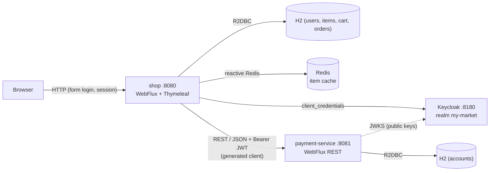
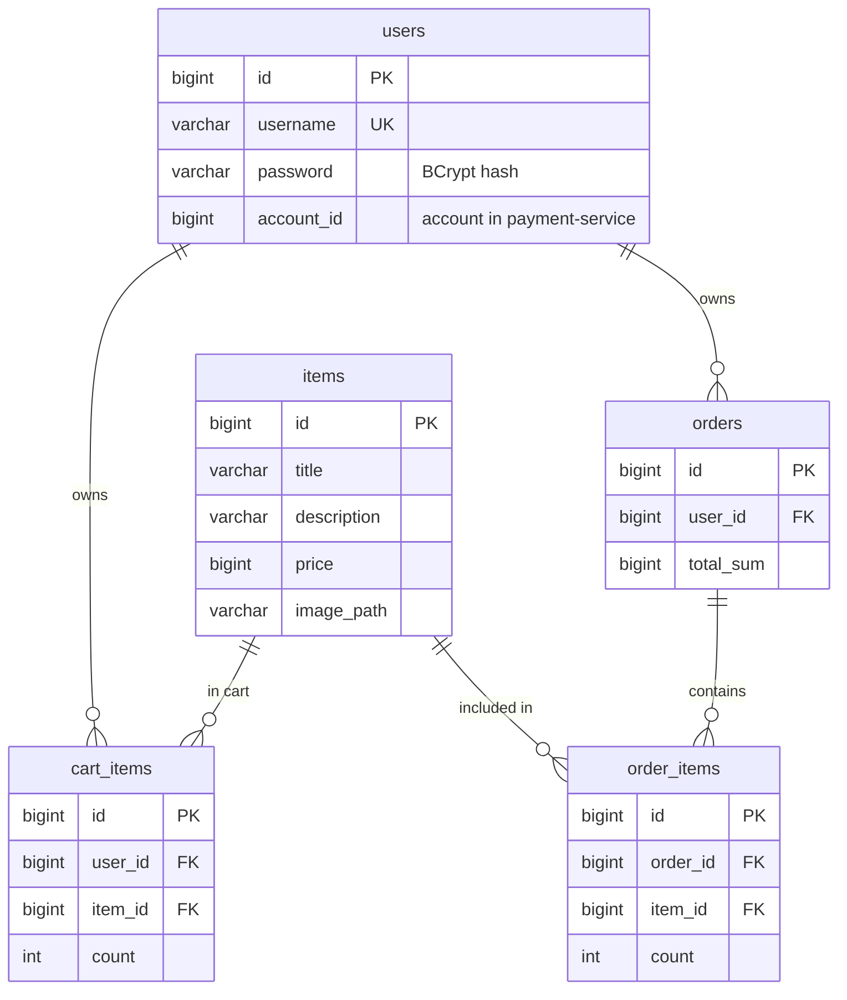
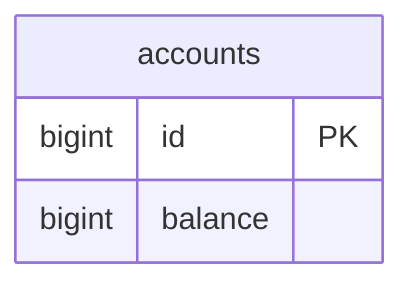

# my-market-app

Reactive online store split into two modules:

- **`shop`**: the main app for browsing items, managing a cart, and placing orders.
- **`payment-service`**: a RESTful service that manages accounts, checks the balance and withdraws funds.

The main app talks to the payment service over a REST api, caches the item catalog in Redis and uses H2 as datasource for item/orders/cart data. Access is protected with Spring Security: shop users log in with username/password, and service-to-service calls are authorized via OAuth2 Client Credentials against a Keycloak authorization server.

## Contents

- [Stack](#stack)
- [Architecture](#architecture)
- [Security](#security)
- [Build](#build)
- [Run](#run)
- [Test](#test)
- [API](#api)
- [Storage](#storage)

## Stack

- Java 21, Spring Boot 4
- Spring WebFlux (reactive), embedded Netty, Project Reactor (`Mono`/`Flux`)
- Spring Security (form login, OAuth2 client, OAuth2 resource server)
- Keycloak 26 (OAuth2 authorization server, Client Credentials Flow)
- Spring Data R2DBC + H2 (in-memory) for both services
- Spring Data Redis (reactive) for the item cache
- OpenAPI Generator 7.23 (contract-first, reactive client + server)
- Thymeleaf + thymeleaf-extras-springsecurity (main app views)
- Gradle
- JUnit 5, Mockito, Testcontainers, spring-security-test

## Architecture



| Module | Port | Responsibility |
|--------|------|----------------|
| `shop` | 8080 | UI + purchase flow; user authentication; Redis cache |
| `payment-service` | 8081 | Accounts / balance / payment REST API (OAuth2 resource server) |
| Keycloak | 8180 | OAuth2 authorization server (docker-compose service) |
| `openapi/payment-api.yaml` | | Contract shared by both modules |

## Security

### Users (browser -> shop)

- Form login (`/login`) backed by the `users` table (BCrypt hashes, `DbUserDetailsService`).
- Anonymous visitors: catalog and item pages only; cart/order controls are hidden
  (`sec:authorize`), protected endpoints redirect to `/login`.
- Cart, orders and the payment account belong to the authenticated user; a foreign order URL is `404`.
- Self-registration at `/register`: creates an account in `payment-service` first, then the user,
  so a user always has an account. If `payment-service` is down, registration fails and no user
  is created.
- Logout fully invalidates the session (cookie + `WebSession`).

Preloaded users:

| Username | Password | Account | Balance |
|----------|----------|---------|---------|
| `user1` | `password1` | 1 | 100000 |
| `user2` | `password2` | 2 | 5000 |

### Services (shop -> payment-service)

- OAuth2 **Client Credentials Flow** via Keycloak: realm `my-market`, client `shop-client`,
  scopes `payment:read` / `payment:write`, audience `payment-service`.
- `shop` fetches and caches the token transparently (OAuth2 filter on the generated `WebClient`).
- `payment-service` is a stateless resource server (JWT via realm `issuer-uri`, CSRF disabled),
  scopes checked per endpoint: no/invalid token -> `401`, missing scope -> `403`.
- Client secret comes from the `SHOP_CLIENT_SECRET` env var; the dev default
  `default-dev-secret` lives only in `docker-compose.yml`.

## Build

Build everything:

```bash
./gradlew build
```

A single module:

```bash
./gradlew :shop:build
./gradlew :payment-service:build
```

The build generates reactive code (contract-first) from `openapi/payment-api.yaml`: HTTP client (`DefaultApi`) for `shop` and server interface (`AccountsApi`) for `payment-service`.

## Run

### Docker Compose (recommended)

Builds images and starts `shop`, `payment-service`, `keycloak` and `redis` together:

```bash
docker-compose up --build
```

- Main app: http://localhost:8080
- Payment service: http://localhost:8081
- Keycloak: http://localhost:8180 (admin console: `admin`/`admin`)
- Redis: `localhost:6379`

The realm `my-market` is imported automatically from `keycloak/my-market-realm.json`.

Stop and remove:

```bash
docker-compose down
```

View logs (follow, `Ctrl+C` to stop):

```bash
docker-compose logs -f shop
docker-compose logs -f payment-service
docker-compose logs -f                   #both apps
```

### Locally, service by service

> **Required:** when `shop` is started outside docker-compose, the OAuth2 client secret
> **must** be provided via the `SHOP_CLIENT_SECRET` env variable (for the dev realm:
> `default-dev-secret`). There is no default in `application.yaml` on purpose,
> so without the variable the app will not start.

Keycloak is required (easiest from compose):

```bash
docker-compose up -d keycloak redis                             # Keycloak :8180 + Redis :6379
./gradlew :payment-service:bootRun                              # payment :8081
SHOP_CLIENT_SECRET=default-dev-secret ./gradlew :shop:bootRun   # main app :8080
```

Redis is optional for local runs. Without it the main app falls back to the DB.

## Test

```bash
./gradlew test
```

Integration tests use Testcontainers, so Docker must be running. Keycloak is NOT needed
for tests: shop tests mock the payment client, security tests inject authentication via
`spring-security-test` (`mockUser`, `mockJwt`, `csrf`).

### `shop`

- **Unit**: `RedisItemProviderUnitTest`, `ItemServiceUnitTest`,
  `CartServiceUnitTest`, `OrderServiceUnitTest`, `PaymentServiceClientUnitTest`,
  `ItemMapperTest`, `OrderMapperTest`.
- **Repositories**: `ItemRepositoryTest`, `CartItemRepositoryTest`,
  `OrderRepositoryTest`, `OrderItemRepositoryTest`.
- **Controllers** (`@WebFluxTest` + `SecurityConfig`): `ItemControllerTest`,
  `CartControllerTest`, `OrderControllerTest`, `ImageControllerTest`, `RegistrationControllerTest` -
  authenticated/anonymous access, CSRF, per-user wiring, hiding controls from anonymous.
- **Integration**:
  - `RedisItemProviderIntegrationTest`: item details come from Redis, missing ones from the
    DB, id order kept.
  - `ItemServiceIntegrationTest`: catalog and item page read through the cache.
  - `CartServiceIntegrationTest`: cart changes and total against the real DB.
  - `OrderServiceIntegrationTest`: buy saves the order and clears the cart (payment mocked).
  - `ShopFlowIntegrationTest`: real form login with CSRF, full purchase flow, user isolation,
    logout, session fixation protection, registration of a new user.
  - `PaymentServiceClientIntegrationTest`: client calls a Testcontainers Microcks mock over
    HTTP and maps `200`/`404`/`422` to results (plain JUnit, not `@SpringBootTest`).

### `payment-service`

- **Unit**: `PaymentServiceUnitTest`.
- **Repositories**: `AccountRepositoryTest`.
- **Integration**: `AccountsControllerIntegrationTest` (`mockJwt` with scopes):
  no token -> `401`, wrong scope -> `403`, and business responses `200`/`201`,
  `404` (unknown account), `422` (insufficient funds), `400` (invalid amount).

## API

### `shop` web endpoints

| Method | URL | Access | Description |
|--------|-----|--------|-------------|
| GET | `/`, `/items?search=&sort=NO&pageNumber=1&pageSize=5` | public | Items (search, sort, pagination) |
| GET | `/items/{id}` | public | Item page |
| GET | `/images/{id}` | public | Item image |
| GET/POST | `/login` | public | Login form / form login |
| GET/POST | `/register` | public | Registration form / create user (+account) |
| POST | `/logout` | authenticated | Logout, invalidates the session |
| POST | `/items`, `/items/{id}` | authenticated | Change item quantity in cart |
| GET/POST | `/cart/items` | authenticated | Cart view / change quantity |
| GET | `/orders`, `/orders/{id}` | authenticated | Own orders only |
| POST | `/buy` | authenticated | Place an order (calls the payment service) |

Anonymous requests to protected endpoints are redirected to `/login`.

### `payment-service` (REST / JSON, OAuth2 resource server)

| Method | URL | Scope | Body | Responses |
|--------|-----|-------|------|-----------|
| POST | `/accounts` | `payment:write` | | `201` `{ accountId, balance }` (id generated, default balance from config) |
| GET | `/accounts/{accountId}/balance` | `payment:read` | | `200` `{ balance }` · `404` account not found |
| POST | `/accounts/{accountId}/payment` | `payment:write` | `{ amount }` | `200` `{ balance }` · `404` account not found · `422` insufficient funds |

Every request requires a Bearer JWT from the `my-market` realm. Errors use `{ code, message }`
with `code` `ACCOUNT_NOT_FOUND` or `INSUFFICIENT_FUNDS`.

## Storage

Both services use an in-memory H2 database over R2DBC (created on startup from
`schema.sql` + `data.sql`, reset on restart). `shop` additionally caches items in Redis.

### `shop`

#### Database (H2)

Tables `users`, `items`, `cart_items`, `orders`, `order_items`. Cart items and orders
belong to a user (`user_id` FK); `users.account_id` points to the account in
`payment-service`. Item images are files on the classpath (`items.image_path` holds
the file name, served by `ImageController`).



#### Cache (Redis)

Items are cached through `RedisItemProvider`:

- Key `my-market-app:item:{id}`, value is the item stored as JSON. TTL is set by
  `app.cache.items.ttl` (set as `120s` atm).
- Catalog listing: the DB returns only the **ordered ids + cart counts** for the page (a light query),
  items details are fetched from Redis with a single `MGET`,
  missed items are loaded from the DB in one batch and written back, then assembled with cached items.
- Cart counts are per-user and never cached.
- Item **images are not cached** (static files served from the classpath).
- If Redis is unavailable the provider **falls back to the DB**, so the main app keeps working (just without the cache).

### `payment-service`

#### Database (H2)

Single `accounts` table. Ids are generated by the DB (identity starting at `1000`, so
they never clash with the seeded demo accounts). New accounts get the default balance
from `app.account.default-balance` (10000 atm). Seeded: account `1` (balance `100000`)
and account `2` (balance `5000`).


