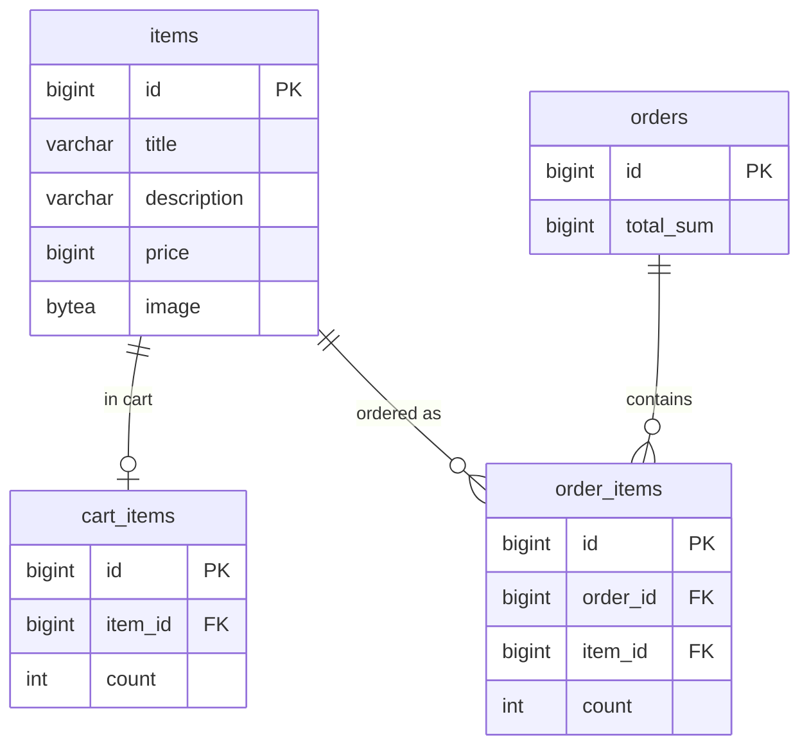

# my-market-app

Store web app: browse items, manage a cart, place orders.

## Stack

- Java 21, Spring Boot 4
- Spring Web MVC + Thymeleaf
- Spring Data JPA + Hibernate
- H2 (in-memory), schema and seed data via Liquibase
- Executable JAR with embedded Tomcat
- Maven

## Build

```bash
./mvnw package
```

## Run

```bash
./mvnw spring-boot:run
```

or

```bash
java -jar target/my-market-app-1.0.0-SNAPSHOT.jar
```

App starts on http://localhost:8080

## Docker

```bash
docker build -t my-market-app .
docker run -d -p 8080:8080 --name my-market-app my-market-app
```

`-d` runs the container detached (in the background). Logs and stop:

```bash
docker logs -f my-market-app
docker stop my-market-app
```

## API

| Method | URL | Description                   |
|--------|-----|-------------------------------|
| GET | `/`, `/items?search=&sort=NO&pageNumber=1&pageSize=5` | get items (search, sort, pagination) |
| POST | `/items` | Change item quantity in cart  |
| GET | `/items/{id}` | Item page                     |
| POST | `/items/{id}` | Change item quantity in cart from the item page |
| GET | `/cart/items` | Cart                          |
| POST | `/cart/items` | Change quantity / remove item in cart |
| GET | `/orders` | Orders list                   |
| GET | `/orders/{id}` | Order page                    |
| POST | `/buy` | Place an order from the cart  |
| GET | `/images/{id}` | Item image                    |

## Database

In-memory H2, started with the app. Schema and demo items are applied by Liquibase
(`src/main/resources/db/changelog`).

### Schema



## Tests

```bash
./mvnw test
```

### Unit (Mockito, no Spring context)
- Services: `CartServiceUnitTest`, `ItemServiceUnitTest`, `OrderServiceUnitTest`
- Mappers: `ItemMapperTest`, `OrderMapperTest`

### Integration
- End-to-end web flow: `ShopFlowIntegrationTest`
- Controllers: `ItemControllerTest`, `CartControllerTest`, `OrderControllerTest`, `ImageControllerTest`
- Services: `CartServiceIntegrationTest`, `ItemServiceIntegrationTest`, `OrderServiceIntegrationTest`
